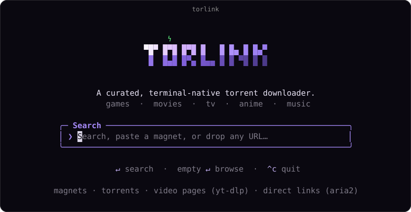
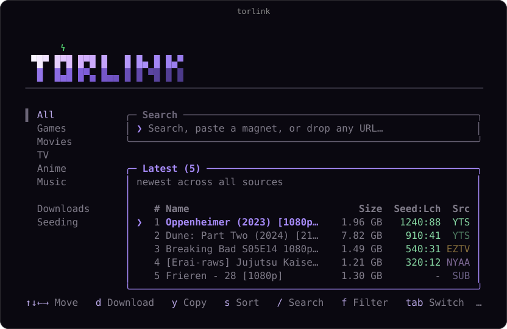
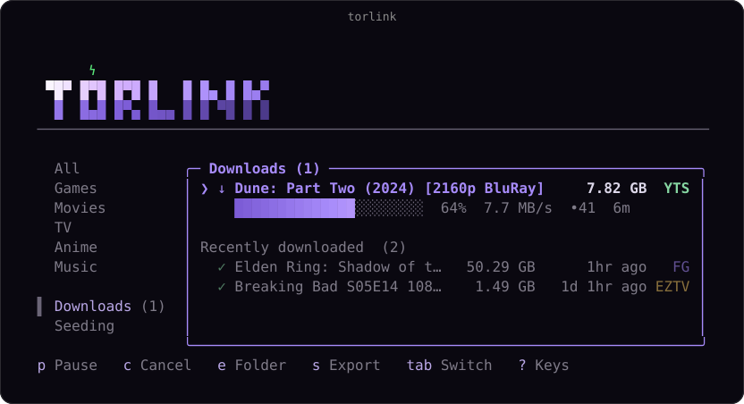

<p align="center">
  
</p>

Finding a torrent these days sucks. One site is a minefield of fake download buttons. Another hides the real link under a popup that spawns two more tabs. And after all that, half the results are dead, zero seeders.

Grab is a torrent finder that lives in your terminal, with zero setup and nothing to configure. One search checks a short, curated list of reputable sources at once, and whatever you pick downloads straight to your computer. The files are yours, saved to your downloads folder.

## Get started

1. **Install Node** (from [nodejs.org](https://nodejs.org)), it's all Grab needs.
2. **Open your terminal.**
3. **Start it:**

   ```sh
   npx grab
   ```

That's the only thing you'll type. Grab opens straight to a search bar: search for what you want, paste in a magnet link or a bare infohash, or just press Enter on an empty box to browse the curated library. From there it's all keypresses, nothing to memorize, and `?` brings up the full list anytime.

## Finding something

Type what you're looking for and press Enter. Results stream in from every source as they answer, tagged with size and how many people are sharing each one, so you can see what'll come down fast. Arrow to what you want and press `d` to save it, or `shift+d` to pick a different folder for just that download.

<p align="center">
  
</p>

## Your downloads

Active downloads sit up top with their progress, speed, and time left; when one finishes it drops into Recently downloaded just below, so the list stays tidy. Everything's still there when you come back, and anything interrupted picks up where it left off.

Downloads run in the background while you keep searching, so you can queue up as many as you want. They save to your downloads folder, and the Downloads pane keeps tabs on each one; press `o` anytime to change where that is, or grab one result with `shift+d` to send it somewhere else without touching the default. When something finishes it keeps seeding automatically so the next person can find it too, and the Seeding tab lets you pause or stop that anytime.

<p align="center">
  
</p>

## What it searches

A short, hand-picked list of trusted sources:

| Category | Sources |
| --- | --- |
| Games | FitGirl |
| Movies | YTS, The Pirate Bay, 1337x, BitTorrented |
| TV | EZTV, The Pirate Bay, 1337x, BitTorrented |
| Anime | Nyaa, SubsPlease |

Games are the only category that can run code, so they come from FitGirl alone, a repacker with a long, trusted track record; everything else is plain video and subtitles. If a source is down, the search carries on without it, and Grab tells you which one is offline.

## Headless

Grab also runs without the TUI, for servers and seedboxes:

    grab watch <dir>    download anything dropped into a folder
    grab serve          take magnets over HTTP
    grab files          stream finished downloads over HTTP
    grab attach         keep the TUI alive across ssh sessions

Add `--daemon` to keep watch, serve, or files running after you log out; `grab --help` has the full list of modes and flags.

## Contributing

To run or work on Grab locally:

1. Clone the repository and open the folder.
2. Install dependencies:
   ```sh
   npm install
   ```
3. Run the development version:
   ```sh
   npm run dev
   ```
   Or build it and run the bundled version:
   ```sh
   npm run build
   npx grab
